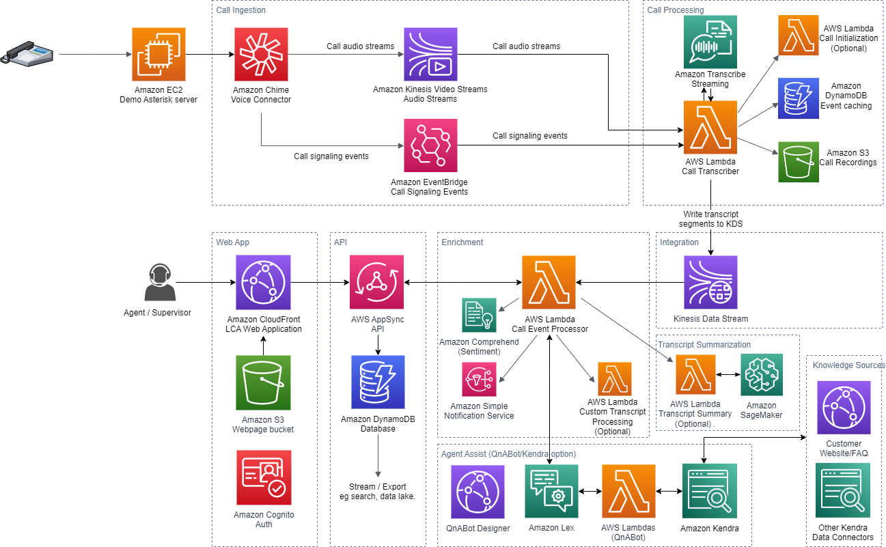
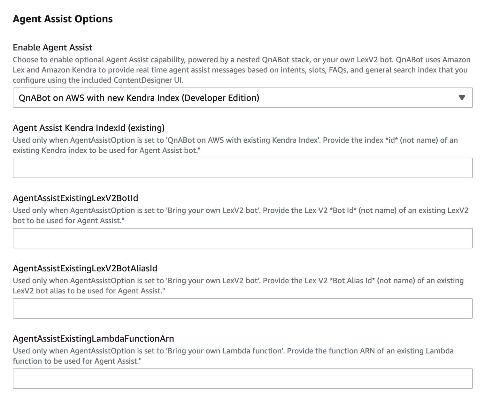
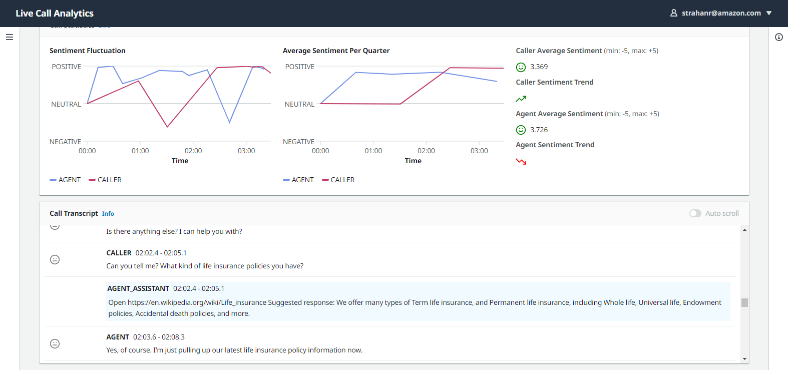
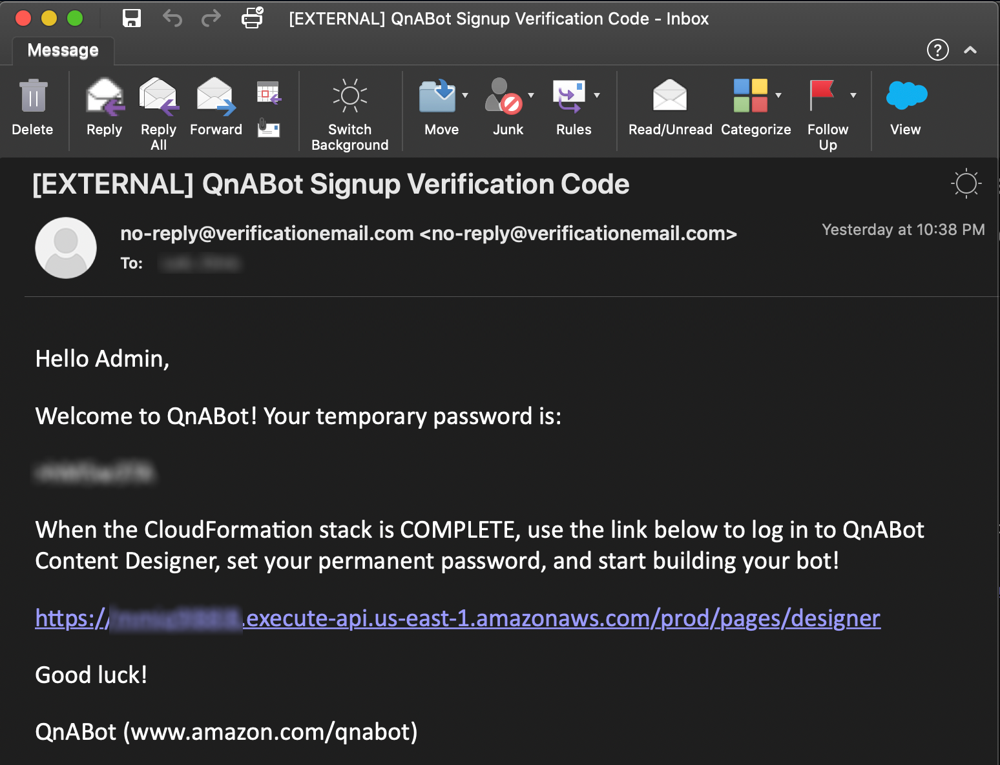
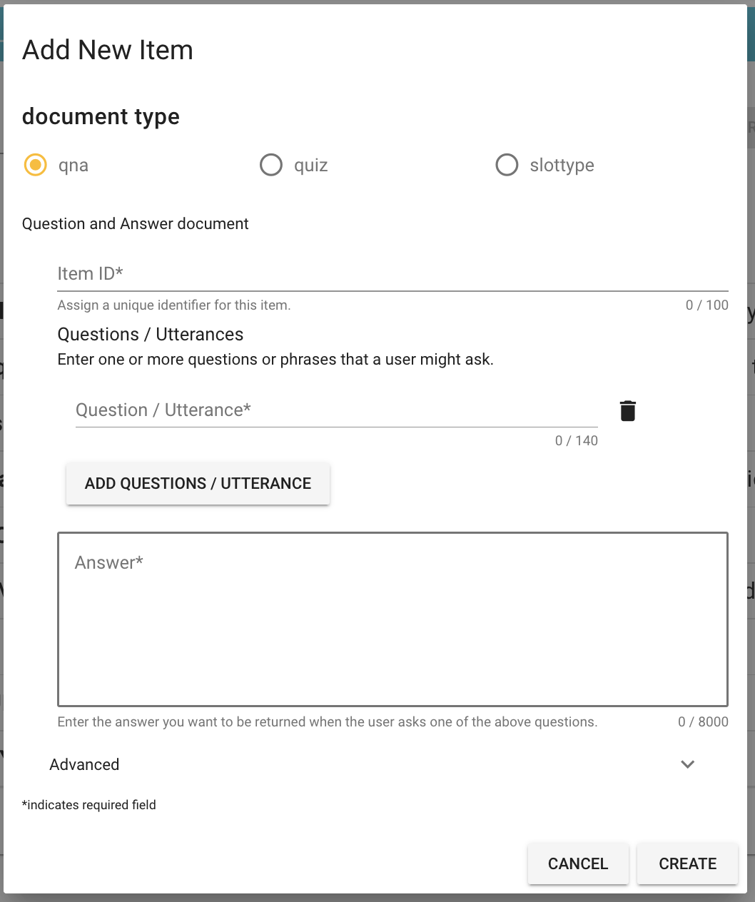
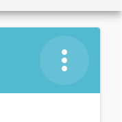
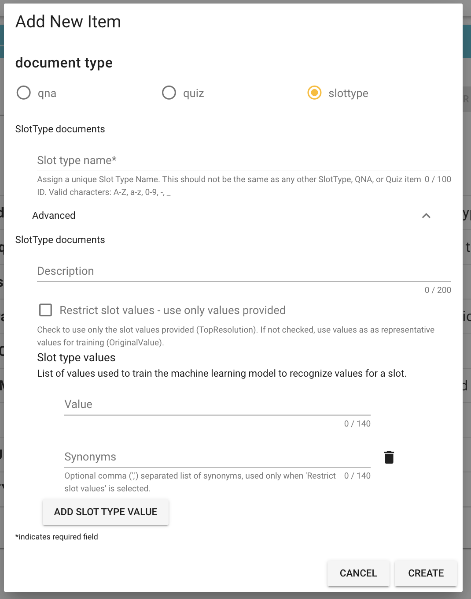
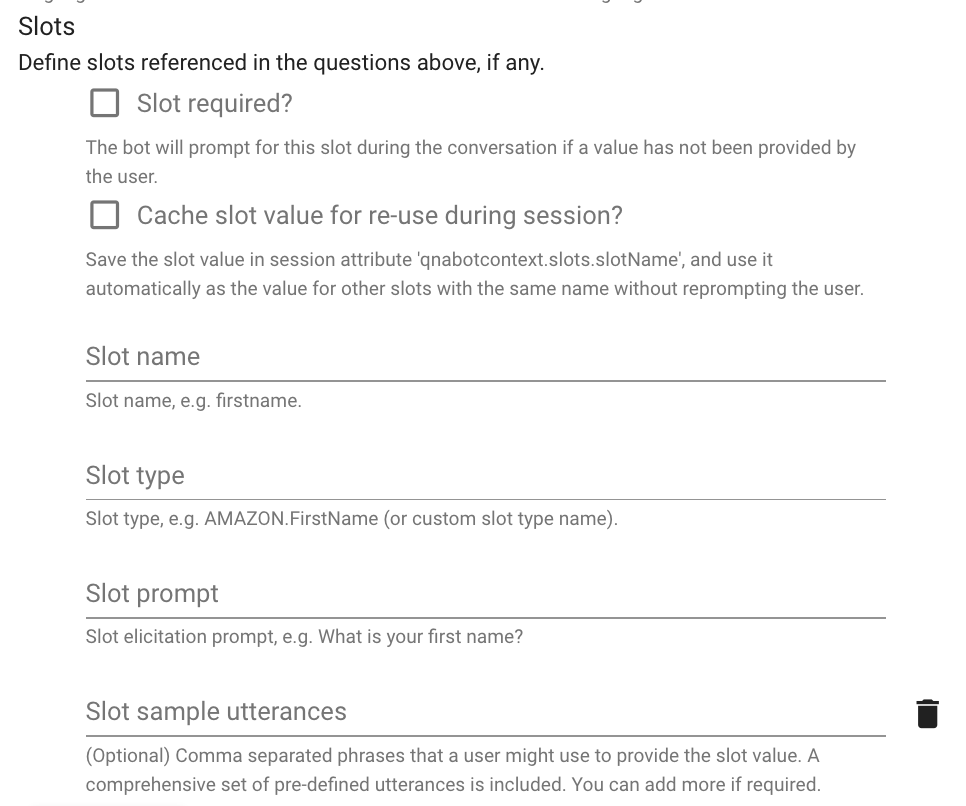
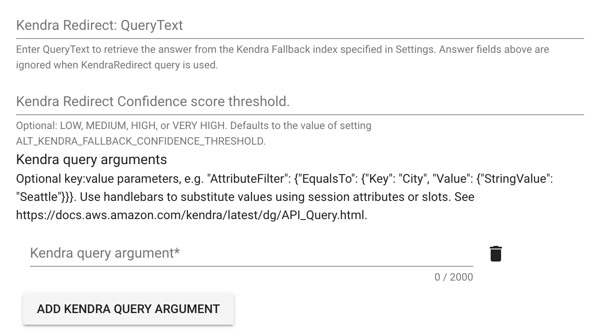
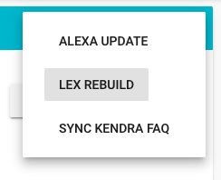

# Agent Assist

## Table of Contents

* Introduction
* How it works
* How to enable Agent Assist in Live Call Analytics
* Testing Agent Assist
* Configuring custom Agent Assist responses (configuration)
  * Question and Answer Response
    * Static response
    * Dynamic responses (also talk about why to use Lex Intent before going into response types)
      * Context-aware (QID w/ Handlebars, variables and if statements)
      * Knowledge-base query (Amazon Kendra redirect, optional query parameters)
      * Custom business logic (Lambda hook, backend integration, lookups, etc)
  * Amazon Kendra fallback response
  * Rebuild Lex

## Introduction

**Agent Assist** is a feature that provides **relevant knowledge**, **suggested responses,** or **automation** for call center agents in real-time during a phone call, in order more effectively respond to the needs of the caller. The Agent Assist responses can be a response to a single input spoken by a caller, or can be based on a multiple, turn by turn inputs from the caller to complete a task. 

This document assumes the reader is familiar with Amazon Live Call Analytics (https://amazon.com/live-call-analytics) and has successfully deployed it before. 

## How it works

Agent Assist works by sending the phrases spoken (utterance) by the caller to an **Amazon Lex** bot, in real-time. Amazon Lex is an AWS service for building conversational interfaces for applications using voice and text.  Amazon Lex works by identifying the intent of an input based on pre-defined, customer intents.  Intents can have variable parameters, which are called slots, that can be used to provide a tailored response. For example, if a caller says “I’m calling about my rewards card.”, the intent is that they’re calling about a card, and the slot is the type of card, a “rewards card” in this example. The Agent Assist suggested response can be a detailed marketing message specifically about rewards cards.  Once an intent has been identified, Amazon Lex will look for an answer in **Amazon Kendra,** which **** is a highly accurate and easy to use enterprise search service that's powered by machine learning.

Now let’s examine at an example of a multi-turn Agent Assist scenario.  If a caller says “I’m calling about my card”, but does not specify the type of card, Amazon Lex can identify what the intent is (which is calling about a card), but it still needs more information (the slot value, which is the type of card). In this case, the Agent Assist suggested response would be “What type of card are you interested in? A rewards card or purchase card?”. The caller then can reply with “rewards card”, which will “fulfill” the intent. This means all the required slots have been collected.

Agent Assist uses the QnABot on AWS solution to handle the architecture deployment and configuration of Amazon Lex and Amazon Kendra.  To learn more about QnABot on AWS, see here: https://aws.amazon.com/solutions/implementations/aws-qnabot/

## How to enable Agent Assist in Live Call Analytics

Agent Assist can be enabled within Live Call Analytics during deployment or with a stack update by providing values for the **Agent Assist Options** CloudFormation parameters as seen in the image below:

The main parameter to enable Agent Assist is the “**Enable Agent Assist**” parameter. Any value other than Disabled will enable Agent Assist.  Here is a description of the parameters:

|Value	|Description	|
|---	|---	|
|Disabled	|Selecting this value will disable Agent Assist	|
|Bring your own LexV2 Bot	|Select this value if you already have a pre-configured LexV2 bot. You must provide LCA with the existing Lex Bot ID and Bot Alias in the **AgentAssistExistingLexV2BotId** and **AgentAssistExistingLexV2BotAliasId,** and an existing Kendra index in the **AgentAssistKendraIndexId** CloudFormation parameters.	|
|QnABot on AWS with existing Kendra Index	|This deploys a new QnABot on AWS with an existing Kendra Index. If you select this value, you are required to provide LCA with an existing Kendra index in the **AgentAssistKendraIndexId** CloudFormation parameters.	|
|QnABot on AWS with new Kendra Index (Developer Edition)	|This deploys a new QnABot on AWS with a new Amazon Kendra  Developer Edition Index	|
|QnABot on AWS with new Kendra Index (Enterprise Edition)	|This deploys a new QnABot on AWS with a new Amazon Kendra Enterprise Edition Index	|
|Bring your own Lambda function	|This will send the customer's speech to a Lambda function. This will allow you to build your own custom Agent Assist integrations, for example, look up responses in a 3rd party knowledge base or API.	|

All the values with “QnABot on AWS” will deploy a new QnABot on AWS into your account, pre-configured with example Agent Assist suggested responses. 

Once you have filled out the Agent Assist CloudFormation parameters, finish deploying or updating the LCA stack.  

## Testing Agent Assist

Login to the Live Call Analytics main screen and make a phone call. You can use the standard agent recording, or have a live agent.  

When the call starts, click on the call to see the live transcript, and ask the question **“Do you offer life insurance policies?”.**  If Agent Assist is working, you should see the AGENT_ASSISTANT response in blue, similar to the screenshot below:

Some other example phrases you can ask as the caller are below.  See more on response types in the next section.

|Phrase	|Response Type	|Details	|
|---	|---	|---	|
|My credit card was stolen.	|Static response	|Simple paragraph response the agent can read to the user, directing them to report their card on a website.	|
|I want to pay my credit card bill.	|Dynamic, context aware response	|3 slots required:  Account Number, Account Type, and Amount to pay. Agent Assist suggested responses will ask for these values if necessary.	|
|I’m calling about my rewards card.	|Dynamic, knowledge base response	|2 slots required: Card Type and First Name.  Agent Assist suggested responses will ask for these values if necessary.  

Note: In the phrase, it already says the card type, "rewards card", so Agent Assist knows not to ask for it again. If the caller says 'I'm calling about my card', then Agent Assist will ask which type of card.	|
|What is the cash back rate for this card?	|Dynamic, context aware response	|1 slot required: Card Type.  

Note: Agent Assist can share the value of slots between different intents, so it may already have the Card Type from the previous phrase and will not ask for it again.	|
|What types of accidents are covered by accidental death insurance?	|Amazon Kendra fallback response	|There is no preconfigured response for this question, so the utterance is sent to Amazon Kendra to see if there is any relevant information in the knowledge base.	|
|That’s all I need for now.	|Static response	|Many companies require agents to wrap up a call with very specific messaging. This response is tailored to the caller, including the caller's name. 	|

The Agent Assist testing script can be found here: <PUT LINK TO SCRIPT MARKDOWN>

## Configuring Agent Assist Responses 

When deploying Agent Assist, you should have received an email titled “QnABot Signup Verification Code” with a temporary password and a link to the QnABot Content Designer. 

Click the link to login to the QnABot Content Designer.  The login is ‘Agent’, and the temporary password is in the email.  You will be required to change the password the first time you login.

Agent Assist responses can be categorized into 5 types: 

|Response Type	|Details	|
|---	|---	|
|Static response	|This is a simple response to a phrase that does not require any additional information/slots.	|
|Dynamic - Context aware response	|This is a response that requires more information (slots) before it can provide an appropriate suggested answer.  Agent Assist may ask for the values of the slots before providing the final suggested response. Responses can be dynamic and formatted with [handlebars](https://catalog.us-east-1.prod.workshops.aws/workshops/20c56f9e-9c0a-4174-a661-9f40d9f063ac/en-US/qna/handlebars).	|
|Dynamic - knowledge base query response	|This will look up a response from Amazon Kendra with a specified Query. Queries can be simple static text or dynamic text with handlebars. Queries also support Amazon Kendra Query Arguments, such as AttributeFilters. 	|
|Dynamic - custom business logic response	|This will call an AWS Lambda function, along with the entire context, so that you can write custom business logic in the function, such as look up information in a 3rd party database or API.	|
|Amazon Kendra fallback response	|If no response from the above is found, the caller's utterance is directly sent to Amazon Kendra. If the Amazon Kendra confidence score returns `HIGH` or `VERY_HIGH`, the response is sent to the agent. The confidence score threshold can be configured in the QnABot on AWS settings.	|

The first four types, static and dynamic responses, are synced to Amazon Kendra FAQs. This provides a semantic aware search for any of the utterances and responses in these items.  

### **Static Response**

To begin configuring a new static response inside QnABot Designer, select the **Add** button in the upper right.  A popup will appear similar to the following screenshot:

* Select **qid** as the document type
* Fill in an **Item ID**, this should be unique per response
* Add one or more **Question/Utterance**. These are phrases that a caller may say to the agent.
* Add the suggested agent response in the **Answer** text box.  This will appear as the AGENT_ASSISTANT message inside of Live Call Analytics.
* Select **Create** to save your new Agent Assist response.
* Select the menu icon in the top right of the QnABot Designer (it is 3 dots), then select **Sync Kendra FAQ**

### **Dynamic, Context Aware Response**

Responses that have inputs, also called slots, require you to first configure the SlotType. There are two example slot types in the examples, SlotType.ACCOUNTTYPE and SlotType.CARDTYPE. You may also skip creating your own slot type if you want to use any of the built-in Amazon Lex V2 slot types, such as Amazon.FirstName, Amazon.City, etc.  The full list of built-in slot types can be found here: https://docs.aws.amazon.com/lexv2/latest/dg/howitworks-builtins-slots.html

To create a new slot type, select the same **Add** button in the upper right of QnABot Designer, and choose the **slottype** document type. Expand the Advanced section and it will look like the screenshot below:

* Fill in the **Slot type name**.  This should be something like SlotType.XYZ
* Fill in the optional **Description**. 
* Decide if you should select **Restrict Slot Values**. Recommendation: Check on.    If checked, only values explicitly defined in the value or synonyms will be accepted. If not checked, then the suggested values will be used as training data, and the actual value collected by the slot may vary.
* Add one or more **Slot type values**.  Each slot type value must contain a value, and may contain optional synonyms. The optional synonyms are a comma separated list of values. For example, the value for ‘checking’ may have the synonym ‘checking account’. 
* When you are done with your slot, select **Create** to save it.

Once you have completed creating your slot types (or have skipped because you will use the default built-in LexV2 slot types), you then need to create a new qid response that will use those slot types.

* Select the same **New** button and choose **qid** as the document type.
* Fill in a unique **Item ID** for this response.
* Fill in one or more **utterances**, or phrases that a user may say where you want to provide the recommended agent response. These utterances may contain a slot type’s value, for example, ‘I’m calling about my rewards card’, where the word rewards is a SlotType.CARDTYPE.  To add these utterances, replace the word rewards with {cardtype}, for example, ‘I’m calling about my {cardtype} card.’  
*  Fill in the **Answer**.  You can use QnABot’s support for **Handlebars** (https://github.com/aws-solutions/aws-qnabot/blob/main/docs/Handlebars_README.md) to build complex, dynamic answers based on the value of the slots. If you need to programmatically provide an answer based on a lookup to a database or 3rd party API, you can use a **Lambda Hook** (https://github.com/aws-solutions/aws-qnabot/tree/main/docs/lambda_hooks)
* Select **Advanced** to expose the advanced section.
* Scroll down to ‘**Create a dedicated bot intent for this item during LEX REBUILD**’, and **check** it. 
    * 
* Scroll down to the Slot section and fill out the following information for each slot used by this qid.
    * 
    * **Slot required checkbox** - This will force the customer to provide the slot value before a suggested answer will be provided to the agent
    * **Cache slot value checkbox** - This will allow Agent Assist responses (qids) to share the value of this slot with other responses
    * **Slot name** - This value is used in the utterance (for example, {cardtype} above), as well as sets as sets a Lex session attribute with the same key/name.
    * **Slot type** - this defines what type of information will be collected. It may be a slot type that you defined, for example, SlotType.CARDTYPE, *or* it may be one of the Built-In slot types such as Amazon.FirstName, Amazon.City, etc.  More about built-in slot types here: https://docs.aws.amazon.com/lexv2/latest/dg/howitworks-builtins-slots.html
    * **Slot prompt** - If the caller does not provide an utterance that has the slot value, this is the Agent Assist suggested response that prompts the agent to ask for this slot.  For example, ‘Ask: Is this a rewards card, or a purchase card?“
    * **Slot sample utterances** - This is a comma delimited list of utterances a user may reply after being asked about the slot, for example, ‘It's a {cardtype} card'.  
        **Note**: you must use the Slot name with handlebars in the utterance.
        **Second Note**: Slot sample utterances are not required for the built-in LexV2 responses.
* When complete with entering in all slots, scroll to the very bottom and select **Create** to save your new slot-based Agent Assist suggested response. 

### Dynamic, Knowledge Base Query 

Agent Assist responses can look up answers with an Amazon Kendra query to provide a dynamic answer. After configuring the response’s utterances, slots and a default answer, expand the ‘Advanced’ section and scroll down to the Amazon Kendra section, seen in the following screenshot:

The first parameter is ‘Kendra Redirect:QueryText’, which is passed as the query string to Amazon Kendra. This query can be a static string such as ‘What is the APR on the rewards card?’ or it also supports handlebars.

The second parameter is the Kendra Confidence Score Threshold.  Every search result from Amazon Kendra contains a confidence score of LOW, MEDIUM, HIGH, or VERY_HIGH.  This parameter will only return results equal to or higher than the value.

The last parameter, Kendra Query Arguments, allows for more fine grained search with Amazon Kendra. These query arguments are passed in to the Kendra query. These arguments can be [AttributeFilters](https://docs.aws.amazon.com/kendra/latest/dg/filtering.html#search-filtering), [Facets](https://docs.aws.amazon.com/kendra/latest/dg/filtering.html#search-facets), [UserContexts](https://docs.aws.amazon.com/kendra/latest/dg/user-context-filter.html), and [more](https://docs.aws.amazon.com/kendra/latest/dg/API_Query.html).

### Dynamic, Custom Business Logic

Custom business logic is accomplished by writing a custom AWS Lambda Function. This provides the capability for looking up information from almost any 3rd party data source, or building other custom integrations. For an example of calling an AWS Lambda function from an Agent Assist response, see the [QnABot on AWS Lambda Hooks README](https://github.com/aws-solutions/aws-qnabot/tree/main/docs/lambda_hooks). 

### Amazon Kendra Fallback Response

If all else fails, and there are no matching Agent Assist responses found, the user’s utterance will be sent to Amazon Kendra. The Amazon Kendra confidence threshold for Kendra Fallback responses can be configured in the QnABot on AWS settings, under the setting name `ALT_SEARCH_KENDRA_FALLBACK_CONFIDENCE_SCORE.`

### Rebuild Lex & Kendra

Once all the Agent Assist responses have been defined, the last step is to rebuild the Lex bot and sync Amazon Kendra.  Choose the 3 dot menu in the upper right corner, and select the **Rebuild Lex** menu option.

After rebuilding Lex, also resync Kendra FAQs, which will sync all the items to Kendra.

## Bring your own Lambda function

If you would like to bypass Lex entirely, select the `Bring your own Lambda function` option in the Enable Agent Assist. You must also put a Lambda ARN of the function that will be invoked. When invoked, LCA will  send the customer's utterance in the event object.  

LCA will expect a JSON response from the Lambda function, with one key named `message` and the value containing the Agent Assist response message.

Example:

``
        {
          "message": "This is the Agent Assist suggested response message."
        }
``